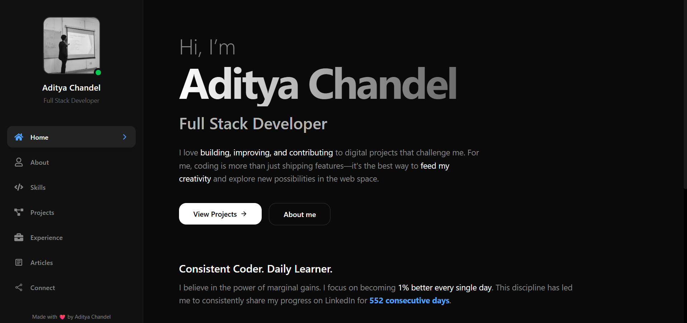

# 🚀 Aditya Chandel — Full Stack Developer Portfolio

<!-- ===================== REPO STATS ===================== -->

<!-- ===================== TECH STACK ===================== -->

A modern, responsive, and performance-focused personal portfolio built to showcase my skills, projects, experience, and learning journey as a **Full Stack Developer**.

---

## 🌐 Live Demo

🚀 **Check it out here**: [Portfolio Website](https://aditya-devfolio-one.vercel.app/)

---

## 📸 Screenshots

### Intro Page

---

## ✨ Overview

This portfolio is designed with a **minimal, dark-themed UI**, smooth animations, and a strong focus on readability and performance.  
It highlights my development journey, technical skills, real-world projects, and consistent learning habits.

Key goals of this portfolio:
- Present my work in a **clean & professional** way
- Ensure **excellent performance and responsiveness**
- Maintain **scalable and maintainable code structure**
- Reflect my philosophy of **daily learning and consistency**

---

## 🎨 Features

- ⚡ Fully responsive design (mobile-first)
- 🌙 Dark mode UI with modern gradients
- 🧭 Sidebar + mobile navbar navigation
- 📊 Live GitHub contribution calendar
- 🔄 Scroll-to-top on route change
- ♿ Accessibility-friendly color contrast & spacing
- 🚀 Optimized build with Vite

---

## 🛠 Tech Stack

### Frontend
- **React.js**
- **React Router**
- **Tailwind CSS**
- **React Icons**

### Tooling & Deployment
- **Vite**
- **Vercel**
- **Git & GitHub**

### APIs & Integrations
- **GitHub Contributions API** (via `react-github-calendar`)

---

## 📸 Sections Included

- **Home / Intro** — Personal introduction and philosophy
- **About** — Background and journey
- **Skills** — Tech stack and tools
- **Projects** — Real-world projects with descriptions
- **Experience** — Work & learning experience
- **Articles** — Technical writings
- **Connect** — Socials and contact information

---

## 🧠 Philosophy

> "Consistency beats intensity."

I believe in improving 1% every day and sharing my progress publicly.  
This portfolio reflects my journey, discipline, and passion for building meaningful digital experiences.

---

## ⭐ Acknowledgements

- React & Vite ecosystem
- Tailwind CSS
- AOS Animations
- GitHub API

---

## 🏁 License

This project is open-source and available under the **MIT License**.

---

Made with ❤️ by Aditya chandel
