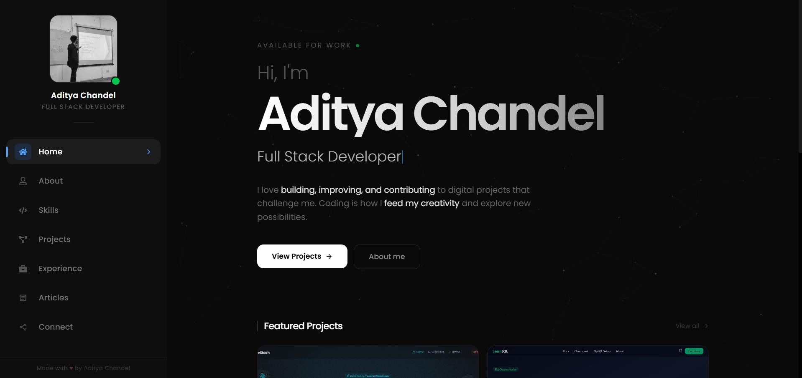

# 🚀 Aditya Chandel — Full Stack Developer Portfolio

<!-- ===================== REPO STATS ===================== -->

<!-- ===================== TECH STACK ===================== -->

---

## 📸 Preview

### 🏠 Home / Intro

---

## 🌐 Live Demo

🚀 **Check it out here**: [Portfolio Website](https://aditya-devfolio-one.vercel.app/)

---

## ✨ About the Project

A **modern, minimal, and performance-focused portfolio** built to showcase my journey as a Full Stack Developer.

This portfolio is not just a collection of projects — it's a reflection of:
- 📈 Continuous growth
- 🧠 Problem-solving mindset
- ⚡ Consistent execution

---

## 🎯 Objectives

- Present my work in a **clean, structured, and impactful way**
- Build a **high-performance and scalable frontend**
- Maintain **clean code architecture**
- Reflect my philosophy of **consistency over intensity**

---

## 🎨 Features

| Feature | Description |
|--------|------------|
| ⚡ Responsive Design | Mobile-first layout optimized for all screen sizes |
| 🌙 Dark UI | Minimal dark theme with subtle gradients |
| 🧭 Navigation | Sidebar + mobile navigation system |
| 📊 GitHub Calendar | Live contribution heatmap integration |
| 🔄 Scroll Behavior | Scroll-to-top on route change |
| ♿ Accessibility | Proper contrast, spacing, and readability |
| 🚀 Performance | Fast build & optimized loading with Vite |

---

## 🧩 Sections

| Section | Description |
|--------|------------|
| 🏠 Home | Introduction and personal philosophy |
| 👤 About | Journey, consistency streak, and background |
| 🛠 Skills | Technologies, tools, and stack |
| 📂 Projects | Real-world work and builds |
| 📈 Experience | Timeline of learning and contributions |
| ✍️ Articles | Technical blogs and insights |
| 🤝 Connect | Contact details and social links |

---

## 🛠 Tech Stack

| Category | Technologies |
|---------|-------------|
| 💻 Frontend | React.js, React Router, Tailwind CSS, React Icons |
| ⚙️ Tooling | Vite, Git, GitHub |
| 🚀 Deployment | Vercel |
| 🔗 Integrations | react-github-calendar |

---

## 🧠 Philosophy

> "Consistency beats intensity."

I focus on becoming 1% better every day —
through building, learning, and refining.

This portfolio is a direct outcome of:

- Daily progress
- Iterative improvement
- Long-term discipline

---

## 🙌 Acknowledgements

| Resource | Contribution |
|----------|-------------|
| React Ecosystem | Core frontend framework |
| Tailwind CSS | Utility-first styling |
| Vite | Fast build tooling |
| GitHub API | Contribution data integration |

---

## 📜 License

This project is licensed under the MIT License.
Feel free to use, modify, and share it – just give proper credit.

Check the [LICENSE](LICENSE) file for more details.

---

Made with ❤️ by Aditya chandel
